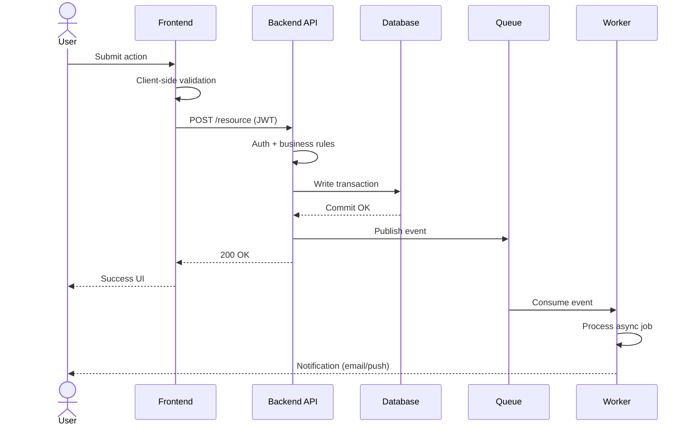
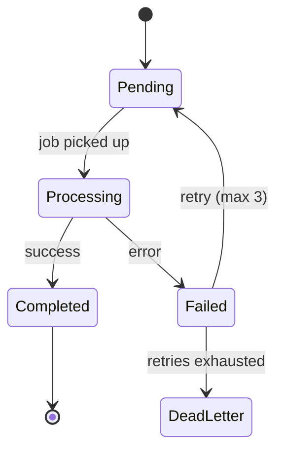
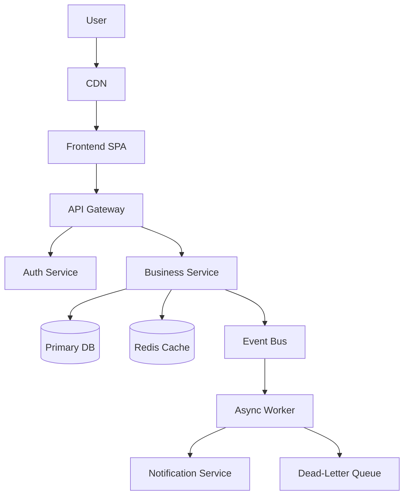
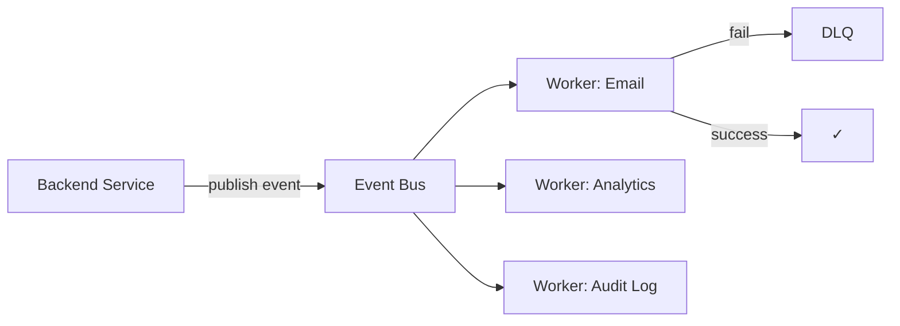

# Workflow Design Skill

Produce clear, layered, ownership-aware system workflow diagrams and documentation.

---

## Step 1 — Identify Workflow Type

Choose the diagram type based on the user's intent:

| Type | Best For |
|---|---|
| **Sequence** | API lifecycle, auth, payments, upload flows, user interactions |
| **Architecture** | High-level service map, infrastructure, service relationships |
| **Event-Driven** | Async processing, notifications, background jobs, queues |
| **State Transition** | Order lifecycle, payment states, approval flows, job states |
| **Data Flow** | ETL pipelines, data movement between systems |

If the user hasn't specified, infer from context. Default to **Sequence** for
request/response flows and **Architecture** for system overviews.

---

## Step 2 — Clarify Before Drawing (if needed)

Only ask if the request is truly ambiguous. One focused question maximum.
Common gaps to probe:

- Is this synchronous, asynchronous, or both?
- Which services are owned internally vs external (third-party APIs)?
- Should failure paths be shown (retries, fallbacks, DLQ)?
- Is the audience technical (engineers) or non-technical (stakeholders)?

---

## Step 3 — Design Principles to Apply

### Ownership Boundaries
Separate lanes or blocks by owner:
- Frontend (client-side validation, UX state)
- API Gateway / BFF
- Backend services (auth, business logic)
- Data layer (DB, cache, blob storage)
- Async workers
- External services / third parties

### Sync vs Async
Mark clearly:
- **Synchronous**: auth, validation, immediate DB reads, inline response
- **Asynchronous**: email/SMS, analytics events, notifications, background jobs

### State Transitions
Track mutations explicitly:
- Data status changes (pending → processing → complete)
- Cache invalidation events
- Event emissions

### Failure Handling
Always include at minimum:
- Retry with backoff
- Timeout boundary
- Error response / fallback path
- Dead-letter queue (DLQ) for async flows

### Layering
Produce diagrams at the right level of detail for the user's need:
- **L1**: High-level architecture (service boxes, arrows)
- **L2**: Request lifecycle (step-by-step sequence)
- **L3**: Implementation detail (DB queries, cache keys, payload shapes)

---

## Step 4 — Output Format

### Preferred: Mermaid Diagrams

Render all diagrams in fenced Mermaid blocks so they display visually.

**Sequence Diagram**


**State Diagram**


**Architecture Diagram**


**Event-Driven Flow**


---

### Secondary: Structured Markdown

Use when Mermaid isn't appropriate (e.g., non-technical audience, documentation prose).

**Flow narrative:**
```
1. User submits form
   → Frontend validates required fields
   → Frontend sends POST /api/resource with JWT

2. Backend receives request
   → Verifies JWT (auth middleware)
   → Validates business rules
   → Writes to DB (transaction)
   → Publishes event to queue
   → Returns 200 OK

3. Async processing
   → Worker picks up event from queue
   → Sends notification (email/push)
   → On failure: retry up to 3× with backoff
   → On exhaustion: route to DLQ
```

---

## Step 5 — Failure Path Checklist

Before finalizing, verify:

- [ ] Auth failure path shown (401/403 → client)
- [ ] DB failure path shown (rollback → 500 → client)
- [ ] Async failure path shown (retry → DLQ)
- [ ] Timeout boundaries defined
- [ ] Idempotency noted where relevant (e.g., payment retry safety)
- [ ] External service failure shown (timeout + fallback)

---

## Step 6 — Observability Annotations (optional)

When the user asks for a production-ready or ops-focused diagram, annotate:

- 📊 Metrics emitted at key steps
- 🔍 Trace spans across service calls
- 📋 Audit log events
- 🔔 Alerting triggers (e.g., DLQ depth, error rate)

---

## Common Workflow Patterns

### Authentication Flow
```
User → Login form → POST /auth/login
→ Verify credentials → Issue JWT + refresh token
→ Return tokens → Store in httpOnly cookie
→ Subsequent requests: validate JWT middleware
→ Token expired: refresh flow or re-auth
```

### File Upload Flow
```
User → Select file → Frontend requests presigned URL
→ Backend generates presigned S3 URL
→ Frontend uploads directly to S3
→ Frontend notifies backend of completion
→ Backend triggers async processing worker
→ Worker processes file → updates DB record
→ Frontend polls or receives webhook notification
```

### Payment Flow
```
User → Checkout → Frontend collects card (Stripe.js)
→ Frontend sends payment token to backend
→ Backend calls payment gateway API
→ On success: DB transaction (order + payment record)
→ Publish order.created event
→ Worker: send confirmation email
→ Worker: notify fulfillment system
→ On failure: surface error to user, no DB write
```

---

## Output Quality Checklist

Before delivering:

- [ ] Diagram type matches the user's need
- [ ] Ownership lanes / boundaries are clear
- [ ] Sync steps distinguished from async steps
- [ ] At least one failure path shown
- [ ] State changes are explicit
- [ ] Diagram is layered at the right level of detail
- [ ] Mermaid syntax is valid (test mentally or note if untested)