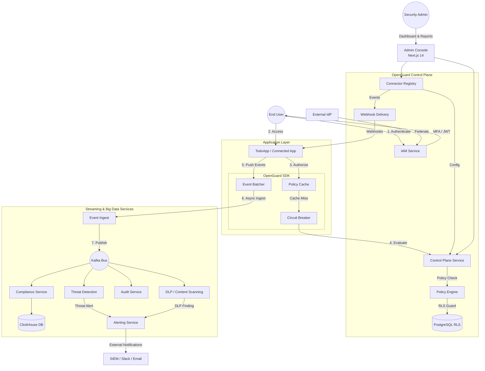

# OpenGuard

> **Enterprise-scale, open-source organization security platform.**

OpenGuard is a self-hostable identity and data security platform, inspired by Atlassian Guard. It provides Fortune-500 grade identity management, real-time policy evaluation, threat detection, and cryptographically verifiable audit trails—all designed with **zero cross-tenant data leakage** and **fail-closed** security principles.

## 🛡️ Core Platform Capabilities & Security Guarantees

OpenGuard provides a unified security control plane built on 10 core Go microservices.

| Service | Category | Capabilities | Security Guarantee |
|:--- |:--- |:--- |:--- |
| **`iam`** | **Identity** | SSO (SAML/OIDC), SCIM 2.0, MFA (WebAuthn), API Tokens | Zero-downtime key rotation & PBKDF2 |
| **`policy`** | **Authorization** | Sub-30ms RBAC/ABAC evaluation, IP Allowlisting | Fail-Closed on service unavailability |
| **`dlp`** | **Data Protection** | Real-time PII, Credential, and Financial data scanning | Inline blocking & Audit log masking |
| **`threat`** | **Detection** | Streaming anomaly scoring (ATO, Geo-velocity, Brute-force) | Detection latency < 5s |
| **`audit`** | **Assurance** | Hash-Chained, append-only event trail | Cryptographically verifiable integrity |
| **`compliance`**| **Analytics** | ClickHouse reports (GDPR, SOC 2, HIPAA) | Real-time dashboards for 100M+ events |
| **`alerting`** | **Alerting** | SIEM (Splunk/CrowdStrike), Slack, and Email delivery | HMAC-signed webhook export |
| **`webhook-delivery`** | **Automation** | Outbound webhooks to Connected Apps | Exactly-once delivery via Outbox |
| **`control-plane`** | **Management** | Centralized API, Ingestion Gateway, Dashboard Backend | Standardized mTLS service mesh |
| **`connector-registry`** | **Inventory** | Application lifecycle, API Key mgmt, Webhook config | Multi-tenant isolation (RLS) |

### 🚀 Organization Security Capability Analysis

| Domain | Capability in OpenGuard | Status |
| :--- | :--- | :--- |
| **Security & Privacy** | Multi-tenancy isolation via PostgreSQL RLS, zero cross-tenant leakage, and cryptographically verifiable audit trails. | **Core Architecture** |
| **IAM** | SSO (SAML/OIDC), SCIM 2.0 provisioning, and MFA (WebAuthn/TOTP) via the `iam` service. | **Implemented** |
| **Secrets Management** | Secrets (keys, tokens) are loaded via **Environment Variables**. Support for local `.env` and production-grade managers like Vault/AWS SM. | **Flexible (Env Vars)** |
| **Threat Detection** | Streaming anomaly scoring for Account Takeover (ATO), Geo-velocity, and Brute-force. | **Roadmap (Phase 4)** |
| **Network Security** | Zero-trust service mesh using mTLS and short-lived certificates (SPIFFE). *Note: Not a WAF or network firewall.* | **Core Architecture** |
| **Data Security** | Data Loss Prevention (DLP) for PII/financial scanning and row-level security (RLS). | **Roadmap (Phase 7)** |
| **Application Security** | Real-time RBAC/ABAC policy evaluation via the `policy` engine and integration SDK. | **Implemented** |
| **Fraud Prevention** | Detection of anomalous patterns like impossible travel and brute force in the `threat` service. | **Roadmap (Phase 4)** |

## 🏗️ Enterprise Architecture

OpenGuard is built for high-scale, zero-trust environments (100k+ users, millions of events/day):

- **Row-Level Security (RLS):** All multi-tenancy isolation is enforced at the database layer (PostgreSQL).
- **Transactional Outbox:** Every Kafka publish is buffered via a transactional outbox to ensure exactly-once audit trails.
- **Resilience & Circuit Breakers:** Every inter-service call wraps a circuit breaker with fail-closed security decisions.
- **CQRS & Saga Pattern:** Clean separation of read/write paths and atomic distributed transactions (Sagas) for provisioning.
- **Zero-Trust internals:** All internal service-to-service communication is secured via mTLS.

## 🔐 System Architecture & Security Ecosystem

OpenGuard follows a **Control Plane + SDK** model. Applications (like the TodoApp) integrate the OpenGuard SDK to perform high-performance policy checks and asynchronous event logging without traffic flowing through a centralized proxy.



## 💻 Tech Stack

- **Backend:** Go 1.22 (Microservices: Gateway, IAM, Policy, Threat, Audit, Alerting, Compliance)
- **Frontend:** Next.js 14
- **Databases:** PostgreSQL 16 (Primary data & Outbox), MongoDB 7 (Audit Logs), ClickHouse 24 (Analytics & Compliance)
- **Event Bus & Cache:** Kafka 3.6, Redis 7
- **Observability:** OpenTelemetry, Prometheus, Grafana, Jaeger

## 📂 Repository Layout

```text
openguard/
├── services/           # Go microservices (gateway, iam, policy, threat, etc.)
├── shared/             # Shared Go module (Kafka outbox, RLS middleware, crypto, models)
├── web/                # Next.js 14 Admin Console
├── infra/              # Docker Compose, K8s manifests, Kafka topics
├── proto/              # Protobuf definitions
└── loadtest/           # k6 load testing scripts
```

## 🚀 Getting Started

### Prerequisites
- Docker & Docker Compose
- Make
- Go 1.22+ and Node.js 20+
- Brew (for k6)
- Playwright (for e2e tests)

### Local Development

1. **Bootstrap the environment:**
   Copy the example environment configuration:
   ```bash
   cp .env.example .env
   ```

2. **Generate mTLS Certificates for internal services:**
   ```bash
   bash scripts/gen-mtls-certs.sh
   bash scripts/gen-mtls-certs.ps1
   ```

3. **Start Infrastructure and Services:**
   ```bash
   make dev
   ```

4. **Run Database Migrations & Create Kafka Topics:**
   ```bash
   make migrate && ./scripts/create-topics.sh
   ```

5. **Run Unit/Integration Tests:**
   ```bash
   make test-unit
   make test-integration
   ```

6. **Run E2E Tests:**
   ```bash
   cd web
   npx playwright test e2e/register.spec.ts --headed
   npx playwright test e2e/login.spec.ts --headed
   npx playwright test e2e/dashboard.spec.ts --headed
   npx playwright test e2e/iam.spec.ts --headed
   npx playwright test e2e/policy.spec.ts --headed
   npx playwright test e2e/audit.spec.ts --headed
   npx playwright test e2e/controlplane.spec.ts --headed
   ```

7. **Run Load Testing (k6):**
   ```bash
   k6 run loadtest/policy-evaluate.js
   ```
