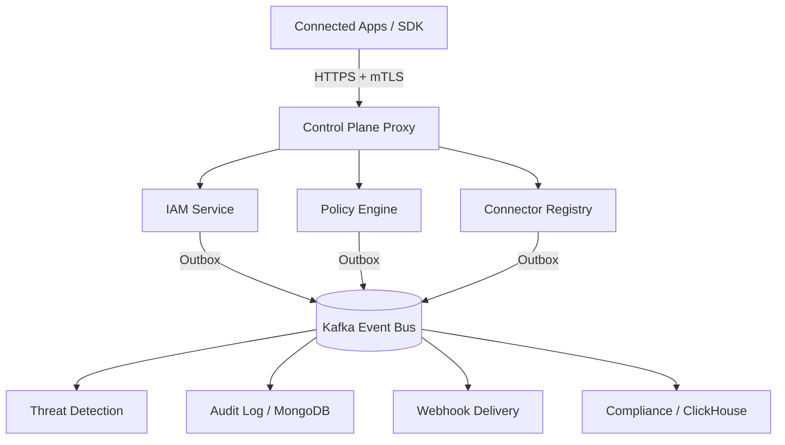

<div align="center">


<br/>

[](LICENSE)
[](go.work)
[](web/package.json)
[](/.github/workflows/ci.yml)
[](docs/openapi/)

**The high-performance security control plane for distributed systems.**
Policy enforcement, cryptographic audit trails, and real-time threat detection — without routing user traffic through a proxy.

[Quick Start](#-quick-start) · [Architecture](#-architecture) · [Services](#-services) · [SDK](#-sdk) · [Deployment](#-deployment)

</div>

---

## 🛡️ What is OpenGuard?

OpenGuard is a **centralized governance hub** designed to sit *beside* your services — not in front of them. Applications register with OpenGuard and integrate via a lightweight SDK, SCIM 2.0, and outbound webhooks. 

**Zero Added Latency:** User traffic never flows *through* OpenGuard. Policy decisions are evaluated at the edge with <1ms latency using local caching and Google's CEL (Common Expression Language).

---

## 🏗️ Technical Stack & Patterns

### **Backend (Go 1.25.0)**
*   **Routing:** [Chi v5](https://github.com/go-chi/chi) for high-performance, context-aware HTTP routing.
*   **Policy Engine:** [Google CEL-Go](https://github.com/google/cel-go) for lightning-fast boolean logic evaluation.
*   **Database:** PostgreSQL with mandatory **Row-Level Security (RLS)** for multi-tenant isolation.
*   **Message Bus:** Kafka for reliable, exactly-once event processing across microservices.
*   **Security:** **mTLS** for all internal service-to-service communication.
*   **Patterns:** 
    *   **Transactional Outbox:** Guarantees that business state changes and audit events are committed atomically.
    *   **Sagas (Choreography):** Manages complex multi-service workflows like SCIM user provisioning.
    *   **Circuit Breakers:** [Sony Gobreaker] protects system stability during partial failures.

### **Frontend (Angular 19+)**
*   **State Management:** [Angular Signals] for fine-grained, reactive state tracking.
*   **Styling:** [Tailwind CSS] for a modern, enterprise-grade admin UI.
*   **Visualizations:** [Chart.js] for real-time threat velocity and anomaly distribution tracking.
*   **Streaming:** [SSE (Server-Sent Events)] for a real-time audit event feed.

---

## 📊 Performance SLOs

Targets verified by k6 load tests. A release does not ship unless every SLO is green.

| Operation | p50 | p99 | Throughput |
|---|---|---|---|
| `POST /v1/policy/evaluate` (Cache Miss) | 5ms | 30ms | 10,000 req/s |
| `POST /v1/policy/evaluate` (Redis Hit) | 1ms | 5ms | 10,000 req/s |
| SDK Local Cache Hit | <1ms | <1ms | Unlimited |
| Kafka Event → Audit DB Insert | — | 2s | 50,000 ev/s |

---

## 🏗 System Topology



---

## 📦 Services Inventory

| Service | Port | Responsibility |
|---|---|---|
| `control-plane` | 8080 | Reverse proxy, rate limiting, circuit breakers. |
| `iam` | 8081 | OIDC, SCIM 2.0, MFA (TOTP/WebAuthn), JWT Lifecycle. |
| `policy` | 8082 | RBAC/CEL evaluation, Redis cache-aside. |
| `threat` | 8083 | Streaming anomaly scoring (Impossible Travel, Brute Force). |
| `audit` | 8084 | Hash-chained, HMAC-verified immutable log (MongoDB). |
| `alerting` | 8085 | Alert lifecycle, SIEM templates (Splunk, Datadog). |
| `connector-registry`| 8090 | App registration, PBKDF2 API key management. |
| `webhook-delivery` | 8091 | HMAC-signed delivery with retry/DLQ logic. |
| `compliance` | 8092 | ClickHouse analytics, **RSA-PSS signed PDF reports**. |
| `dlp` | 8093 | Real-time PII/Credential scanning and redaction. |

---

## 🔌 Connected App Integration (SDK)

The Go SDK handles policy decisions, local caching, and resilience automatically.

```go
client, _ := sdk.NewClient(sdk.Config{
    BaseURL:        "https://api.openguard.io",
    APIKey:         os.Getenv("OPENGUARD_API_KEY"),
    PolicyCacheTTL: 60 * time.Second, // Serves stale for 60s during outages
})

// Fail-closed policy evaluation
allowed, err := client.Allow(ctx, sdk.EvaluateRequest{
    SubjectID: "user:123",
    Action:    "documents:read",
    Resource:  "doc:finance/*",
})
```

---

## 🚀 Deployment & Development

### **Prerequisites**
*   **Go 1.25.0+**
*   **Node.js 22.x+** & npm 10+
*   **Docker** & Docker Compose v2
*   **OpenSSL** (for mTLS cert generation)

### **1. Bootstrap Infrastructure**
```bash
# Generate mandatory mTLS certificates and JWT keys
make certs

# Start full stack (Postgres, Redis, Kafka, MongoDB, ClickHouse + Services)
make dev
```

### **2. Initialize Data**
```bash
make create-topics # Bootstrap Kafka topics
make migrate       # Run PostgreSQL RLS migrations
make seed          # Seed default admin (admin@acme.example / changeme123!)
```

### **3. Verification**
```bash
make test             # Run all backend (race-enabled) and frontend tests
make test-acceptance  # Run the 45-step end-to-end scenario
```

---

## 🚢 Production Deployment

OpenGuard is designed for Kubernetes via Helm. 

```bash
helm repo add openguard https://charts.openguard.io
helm install openguard openguard/openguard -f values.production.yaml
```

**Key Isolation Tiers:**
*   **Shared:** PostgreSQL RLS on shared tables (Default).
*   **Schema:** Dedicated DB schema per Organization.
*   **Shard:** Dedicated PostgreSQL instance per Organization (Enterprise).

---

## 🤝 Contributing

We utilize AI-assisted development workflows. Please refer to these for architectural standards:
*   [**AGENTS.md**](AGENTS.md): High-signal context for AI agents.
*   [**.opencode/config.json**](.opencode/config.json): Machine-readable project specification.

Maintain strict **Context Discipline** and **Error Wrapping** boundaries as defined in our [Backend Spec](ai-spec/be_open_guard/00-code-quality-standards.md).

---

<div align="center">
  <b>OpenGuard — Enterprise Grade Security, Open Source Freedom.</b>
</div>
