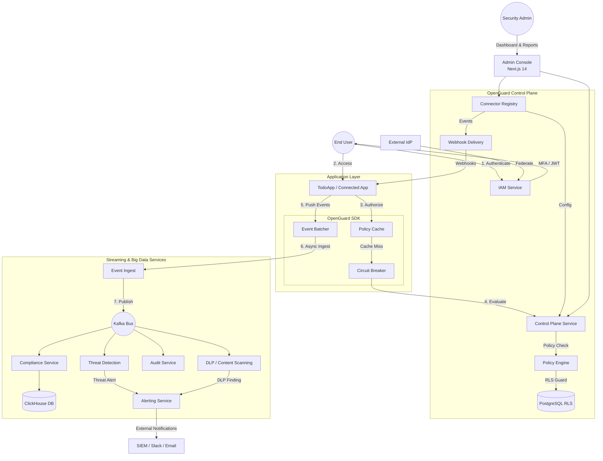

# OpenGuard

> **Enterprise-scale, open-source organization security platform.**

OpenGuard is an open-source, self-hostable **centralized security control plane**. Connected applications register with OpenGuard and integrate via a lightweight SDK, SCIM 2.0, OIDC/SAML, and outbound webhooks—all designed with **zero cross-tenant data leakage** and **fail-closed** security principles.

## 🛡️ Core Platform Capabilities & Security Guarantees

OpenGuard provides a unified security control plane built on 10 core Go microservices.

| Service | Category | Capabilities | Security Guarantee | Status |
|:--- |:--- |:--- |:--- | :--- |
| **`iam`** | **Identity** | OIDC/SAML IdP, SSO, SCIM 2.0, TOTP/WebAuthn, Session Revocation | Zero-downtime key rotation & PBKDF2 | **Implemented** |
| **`policy`** | **Authorization** | Real-time RBAC/ABAC SDK evaluation, Local 60s caching | Fail-Closed on service unavailability | **Implemented** |
| **`audit`** | **Assurance** | HMAC Hash-Chained, append-only event trail | Cryptographically verifiable integrity | **Implemented** |
| **`control-plane`** | **Management** | Centralized API, Ingestion Gateway, Dashboard Backend | Standardized mTLS service mesh | **Implemented** |
| **`connector-registry`** | **Management** | App registration, Org-scoped API credentials | Fast-hash prefix Redis lookup | **Implemented** |
| **`alerting`** | **Alerting** | SIEM (Splunk/CrowdStrike), Slack, and Email delivery | HMAC-signed webhook export | **Roadmap (Phase 4)** |
| **`threat`** | **Detection** | Streaming anomaly scoring (ATO, Geo-velocity, Privilege escalation) | Detection latency < 5s | **Roadmap (Phase 4)** |
| **`webhook-delivery`** | **Automation** | Outbound webhooks to Connected Apps | Exactly-once delivery via Outbox | **Roadmap (Phase 4)** |
| **`compliance`**| **Analytics** | ClickHouse reports (GDPR, SOC 2, HIPAA), PDF output | Real-time dashboards for 100M+ events | **Roadmap (Phase 5)** |
| **`dlp`** | **Data Protection** | Real-time PII, Credential, and Financial data scanning | Inline blocking & Audit log masking | **Roadmap (Phase 10)** |

### 🚀 Organization Security Capability Analysis

| Domain | Capability in OpenGuard | Status |
| :--- | :--- | :--- |
| **Identity (IAM)** | SSO (SAML/OIDC), SCIM 2.0 provisioning, and Phishing-resistant MFA (WebAuthn). | **Implemented** |
| **Authorization** | Real-time RBAC/ABAC evaluation with SDK-side caching and fail-closed security. | **Implemented** |
| **Audit & Compliance**| HMAC Hash-chained, cryptographically verifiable logs. GDPR/SOC2/HIPAA reporting. | **Implemented** |
| **Infrastructure** | Multi-tenant isolation via PG RLS, exactly-once delivery via Outbox, and mTLS mesh. | **Core Architecture** |
| **Threat Detection** | Streaming anomaly scoring for ATO, geo-velocity, and privilege escalation. | **Roadmap (Phase 4)** |
| **Automation** | Outbound webhooks to connected apps with signed payloads and exactly-once delivery. | **Roadmap (Phase 4)** |
| **Data Security** | Real-time Content Scanning & DLP for PII, credentials, and financial data detection. | **Roadmap (Phase 10)** |
| **Management** | Centralized Connector Registry for app onboarding and SDK credential lifecycle. | **Implemented** |

## 🏗️ Enterprise Architecture

OpenGuard is built for high-scale, zero-trust environments (100k+ users, millions of events/day) using a defense-in-depth approach:

- **Fail-Closed Security:** Policy evaluation fails to "Deny" if the control plane is unreachable and local cache has expired.
- **Transactional Outbox:** Prevents the "Dual-Write" problem. Business logic and audit events are committed atomically in PostgreSQL.
- **Row-Level Security (RLS):** Native PostgreSQL RLS ensures zero cross-tenant data leakage at the database layer.
- **Immutable Audit Trail:** Append-only MongoDB logs with per-organization HMAC hash-chaining for cryptographically verifiable integrity.
- **Choreography-Based Sagas:** All distributed provisioning (e.g., SCIM user creation) uses Kafka-based sagas with automated compensation.
- **Access Token Revocation:** Real-time JWT `jti` revocation via Redis blocklist for immediate session termination.
- **Zero-Trust Internals:** Mandatory mTLS with short-lived certificates for all inter-service communication.
- **Resilience Engineering:** Every external call or inter-service request is wrapped in a circuit breaker with a defined fallback.

## 🔐 System Architecture & Security Ecosystem

OpenGuard follows a **Control Plane + SDK** model. Applications (like the TodoApp) integrate the OpenGuard SDK to perform high-performance policy checks and asynchronous event logging without traffic flowing through a centralized proxy.



## 💻 Tech Stack

- **Backend:** Go 1.22 (Microservices: `control-plane`, `connector-registry`, `iam`, `policy`, `audit`, `threat`, `alerting`, `webhook-delivery`, `compliance`, `dlp`)
- **Frontend:** Next.js 14 (Admin Dashboard)
- **Databases:** PostgreSQL 16 (Primary & Outbox), MongoDB 7 (Audit Logs), ClickHouse 24 (Analytics), Redis 7 (Cache & JWT Blocklist)
- **Event Bus:** Kafka 3.6
- **Observability:** OpenTelemetry, Prometheus, Grafana, Jaeger

## 📂 Repository Layout

```text
openguard/
├── services/           # Go microservices (iam, policy, audit, etc.)
│   └── (10 services)   # Each with migrations/ pkg/ router/
├── sdk/                # Multi-tenant Policy & Event SDK (Go)
├── shared/             # Shared logic (Outbox, RLS, Crypto, Models)
├── web/                # Next.js 14 Admin Dashboard
├── docs/               # Architecture, API spec, and Runbooks
├── infra/              # Docker, Helm charts, and Monitoring
├── proto/              # Protobuf & gRPC definitions
├── scripts/            # Life-cycle scripts (gen-mtls-certs.sh, migrate.sh)
└── loadtest/           # k6 performance validation scripts
```

## 🚀 Getting Started

### Prerequisites
- Docker & Docker Compose
- Make
- Go 1.22+ and Node.js 20+
- Brew (for k6)
- Playwright (for e2e tests)

### Local Development

1. **Bootstrap the environment:**
   Copy the example environment configuration:
   ```bash
   cp .env.example .env
   ```

2. **Generate mTLS Certificates for internal services:**
   ```bash
   bash scripts/gen-mtls-certs.sh
   bash scripts/gen-mtls-certs.ps1
   ```

3. **Start Infrastructure and Services:**
   ```bash
   make dev
   ```

4. **Run Database Migrations & Create Kafka Topics:**
   ```bash
   make migrate && ./scripts/create-topics.sh
   ```

5. **Run Unit/Integration Tests:**
   ```bash
   make test-unit
   make test-integration
   ```

6. **Run E2E Tests:**
   ```bash
   cd web
   npx playwright test e2e/real/register.real.spec.ts --headed
   npx playwright test e2e/real/login.real.spec.ts --headed
   npx playwright test e2e/real/dashboard.real.spec.ts --headed
   npx playwright test e2e/real/policy.real.spec.ts --headed
   npx playwright test e2e/real/phase_1_3_real.spec.ts --headed
   ```

7. **Run Load Testing (k6):**
   ```bash
   k6 run loadtest/policy-evaluate.js
   ```
