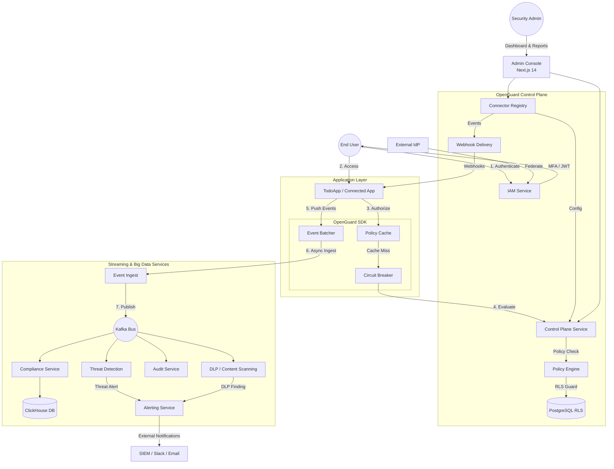

# OpenGuard

> **Enterprise-scale, open-source organization security platform.**

OpenGuard is a self-hostable identity and data security platform, inspired by Atlassian Guard. It provides Fortune-500 grade identity management, real-time policy evaluation, threat detection, and cryptographically verifiable audit trails—all designed with **zero cross-tenant data leakage** and **fail-closed** security principles.

## 🛡️ Core Capabilities

- **Identity & Access Management (IAM):** SSO (SAML 2.0 / OIDC), SCIM 2.0 provisioning, TOTP/WebAuthn MFA, and API token lifecycle.
- **Real-Time Policy Engine:** Sub-30ms RBAC evaluation, data security rules, and session limits. Fails closed when unavailable.
- **Threat Detection:** Streaming anomaly scoring for brute-force attacks, impossible travel, and privilege escalation.
- **Verifiable Audit Log:** Append-only, hash-chained event trail stored in MongoDB to guarantee tamper-evident compliance.
- **Compliance & Analytics:** ClickHouse-powered reporting for GDPR, SOC 2, and HIPAA with PDF generation.
- **Alerting:** SIEM webhook export with HMAC signatures, and Slack/email delivery.

## 🏗️ Enterprise Architecture Guarantees

OpenGuard is built to operate at scale (100k+ users, millions of events/day) without compromising integrity:

- **Transactional Outbox Pattern:** Every Kafka publish is buffered in PostgreSQL via a transactional outbox. Guarantees exactly-once audit trails and eliminates the dual-write problem.
- **Row-Level Security (RLS):** Multi-tenancy isolation is enforced at the database layer (PostgreSQL). A bug in application code cannot expose another organization's data.
- **Resilience & Circuit Breakers:** Every inter-service HTTP call wraps a circuit breaker. Fails gracefully (or fails closed for security decisions).
- **CQRS & Saga Pattern:** Read/write splitting for audit logs. Complex provisioning operations use choreography-based Sagas for atomic distributed transactions.
- **Secret Rotation:** Multi-key JWT signing and AES-encrypted MFA secrets support zero-downtime rotation.
- **Zero-Trust internals:** All internal service-to-service calls use mTLS.

## 🔐 System Architecture & Security Ecosystem

OpenGuard follows a **Control Plane + SDK** model. Applications (like the TodoApp) integrate the OpenGuard SDK to perform high-performance policy checks and asynchronous event logging without traffic flowing through a centralized proxy.



### 🗝️ Core Security Features

| Component | Capabilities | Security Guarantee |
|:--- |:--- |:--- |
| **Control Plane** | Connectors, App Registration, Central Monitoring | Standardized mTLS communication |
| **Identity (IAM)** | SSO (SAML/OIDC), SCIM, MFA (WebAuthn), API Tokens | Zero-downtime JWT key rotation |
| **Logic (Policy)** | RBAC, ABAC, IP Allowlisting, Session Management | Fail-closed on service unavailability |
| **Protection (DLP)** | PII, Credential, and Financial data scanning | Real-time masking and ingestion blocking |
| **Detection (Threat)** | Anomaly scoring, Brute-force, Geo-velocity | Streaming detection with < 5s latency |
| **Assurance (Audit)**| Hash-chained, append-only event trail | Cryptographically verifiable integrity |
| **Insight (Analytics)**| ClickHouse-powered reporting (GDPR, SOC2) | Real-time dashboards for 100M+ events |
| **Automation** | Outbound Webhooks for event-driven security | HMAC-signed delivery with retry tracking |

## 💻 Tech Stack

- **Backend:** Go 1.22 (Microservices: Gateway, IAM, Policy, Threat, Audit, Alerting, Compliance)
- **Frontend:** Next.js 14
- **Databases:** PostgreSQL 16 (Primary data & Outbox), MongoDB 7 (Audit Logs), ClickHouse 24 (Analytics & Compliance)
- **Event Bus & Cache:** Kafka 3.6, Redis 7
- **Observability:** OpenTelemetry, Prometheus, Grafana, Jaeger

## 📂 Repository Layout

```text
openguard/
├── services/           # Go microservices (gateway, iam, policy, threat, etc.)
├── shared/             # Shared Go module (Kafka outbox, RLS middleware, crypto, models)
├── web/                # Next.js 14 Admin Console
├── infra/              # Docker Compose, K8s manifests, Kafka topics
├── proto/              # Protobuf definitions
└── loadtest/           # k6 load testing scripts
```

## 🚀 Getting Started

### Prerequisites
- Docker & Docker Compose
- Make
- Go 1.22+ and Node.js 20+
- Brew (for k6)
- Playwright (for e2e tests)

### Local Development

1. **Bootstrap the environment:**
   Copy the example environment configuration:
   ```bash
   cp .env.example .env
   ```

2. **Generate mTLS Certificates for internal services:**
   ```bash
   bash scripts/gen-mtls-certs.sh
   bash scripts/gen-mtls-certs.ps1
   ```

3. **Start Infrastructure and Services:**
   ```bash
   make dev
   ```

4. **Run Database Migrations & Create Kafka Topics:**
   ```bash
   make migrate && ./scripts/create-topics.sh
   ```

5. **Run Unit/Integration Tests:**
   ```bash
   make test-unit
   make test-integration
   ```

6. **Run E2E Tests:**
   ```bash
   cd web
   npx playwright test e2e/register.spec.ts --headed
   npx playwright test e2e/login.spec.ts --headed
   npx playwright test e2e/dashboard.spec.ts --headed
   npx playwright test e2e/iam.spec.ts --headed
   npx playwright test e2e/policy.spec.ts --headed
   npx playwright test e2e/audit.spec.ts --headed
   npx playwright test e2e/controlplane.spec.ts --headed
   ```

7. **Run Load Testing (k6):**
   ```bash
   k6 run loadtest/policy-evaluate.js
   ```
