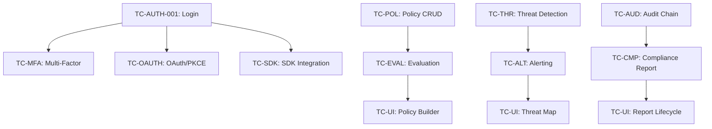

# OpenGuard – E2E Test Suite Index

This directory contains the comprehensive E2E test suite for OpenGuard, organized by domain.

## 📁 Structure

| File | Domain | Coverage |
|---|---|---|
| [01_identity_and_access.md](01_identity_and_access.md) | Identity | Auth, MFA, SSO, SCIM, User Mgmt |
| [02_policy_engine.md](02_policy_engine.md) | Policy | CRUD, CEL Evaluation, Caching |
| [03_threat_detection_and_alerting.md](03_threat_detection_and_alerting.md) | Monitoring | Behavioral Analytics, Alert Lifecycle |
| [04_compliance_and_dlp.md](04_compliance_and_dlp.md) | Data Security | DLP Scanning, SOC2 Reporting |
| [05_integration_and_webhooks.md](05_integration_and_webhooks.md) | Integration | Connectors, Webhooks, API Keys |
| [06_security_resilience_and_audit.md](06_security_resilience_and_audit.md) | Infrastructure | RLS, Circuit Breakers, Audit Chains |
| [07_sdk_integration.md](07_sdk_integration.md) | Client SDK | Fail-Closed, Local Caching, Heartbeats |
| [08_dashboard_ui.md](08_dashboard_ui.md) | Admin UI | Dashboard, Policy Builder, Log Explorer |

## 🔗 Test Dependency Map



```

## 🧪 Testing Tiers Mapping

The test cases in this suite are designed to be multi-purpose, spanning across the following testing tiers:

| Tier | Focus | How to use these Test Cases |
|---|---|---|
| **Unit** | Individual functions/packages | Validate the **System Verifications** logic (e.g., Bcrypt hashing, CEL compilation). |
| **Integration** | Service + DB/Cache/Kafka | Validate the **Persistence** and **Event** steps (e.g., RLS enforcement, Outbox relay). |
| **E2E** | User-facing journey | Execute the **User Flow** and **Steps** using real browsers or SDKs against the full stack. |

## 🚀 Execution Priority

1.  **P0 (Blocking)**: Identity (AUTH-001), Security (SEC-002), SDK (SDK-004).
2.  **P1 (Critical)**: Policy Evaluation, Webhook Delivery, SCIM Provisioning.
3.  **P2 (High)**: Threat Detectors, DLP Scanning, Refresh Token Rotation.
4.  **P3 (Standard)**: SAML, WebAuthn, Compliance PDF generation.
