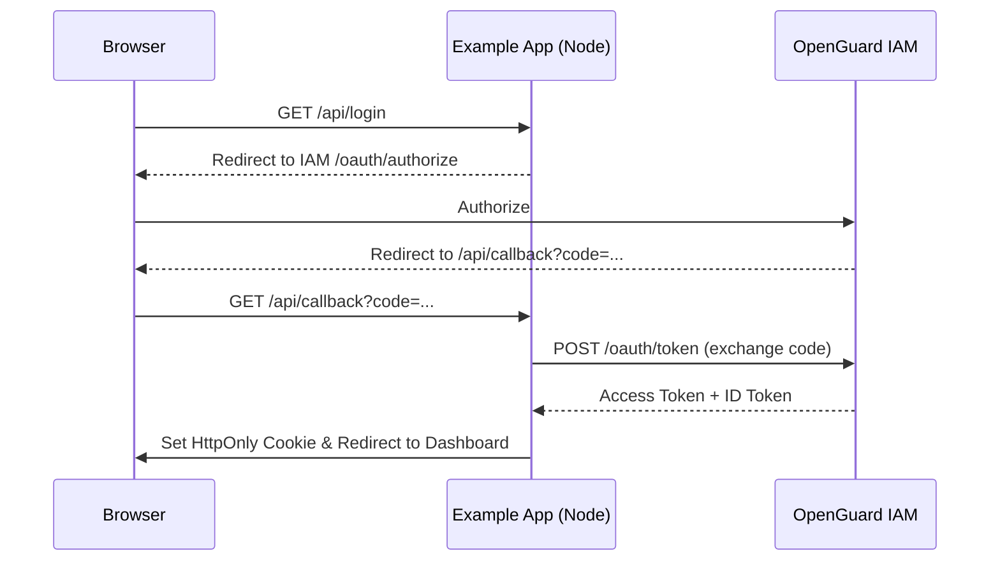

# OpenGuard Example App

A full-stack demonstration of OpenGuard security middleware.

## Quick Start

```bash
# Install dependencies
pnpm install

# Start development servers
pnpm dev
```

This starts:
- Backend server on http://localhost:3001
- Frontend on http://localhost:3000

## Architecture

```
┌─────────────────────────────────────────────────────────┐
│                      Client                              │
│  ┌─────────────┐  ┌─────────────┐  ┌─────────────────┐  │
│  │ Attack      │  │ Live Feed   │  │ OpenGuard SDK   │  │
│  │ Simulator   │  │ (WebSocket) │  │ (Interceptors)  │  │
│  └─────────────┘  └─────────────┘  └─────────────────┘  │
└──────────────────────────┬──────────────────────────────┘
                           │ HTTP / WS
┌──────────────────────────▼──────────────────────────────┐
│                      Server                              │
│  ┌─────────────┐  ┌─────────────┐  ┌─────────────────┐  │
│  │ OpenGuard   │  │ Detectors   │  │ WebSocket       │  │
│  │ Middleware  │  │ Pipeline    │  │ Server          │  │
│  └─────────────┘  └─────────────┘  └─────────────────┘  │
│                      │                                   │
│  ┌──────────────────▼────────────────────────────────┐  │
│  │ Store (Memory / Redis / Upstash)                  │  │
│  └───────────────────────────────────────────────────┘  │
└──────────────────────────────────────────────────────────┘
```

## Trigger Detectors

### SQL Injection
```bash
curl "http://localhost:3001/api/test/sqli?q=1'+UNION+SELECT+*+FROM+users--"
```

### XSS
```bash
curl "http://localhost:3001/api/test/xss?q=%3Cscript%3Ealert(1)%3C/script%3E"
```

### Rate Limit
```bash
for i in {1..10}; do curl http://localhost:3001/api/test/rate-limit; done
```

### Bot Detection
```bash
curl -H "User-Agent: python-requests/2.28.0" http://localhost:3001/api/test/bot
```

### Path Traversal
```bash
curl "http://localhost:3001/api/test/path?file=../../etc/passwd"
```

### Brute Force
```bash
for i in {1..6}; do
  curl -X POST http://localhost:3001/api/login \
    -H "Content-Type: application/json" \
    -d '{"username":"admin","password":"wrong"}';
done
```

## Connecting to OpenGuard

To demonstrate the full power of OpenGuard, connect this example app to a running OpenGuard control plane.

1.  **Start OpenGuard**: Run `docker-compose up -d` from the repository root.
2.  **Configure Environment**: 
    - Copy `.env.example` to `.env`.
    - `OPENGUARD_URL`: The URL of your OpenGuard Policy Service (default: `http://localhost:8080`).
    - `OPENGUARD_ISSUER_URL`: The URL of OpenGuard IAM (default: `http://localhost:8081`).
    - `OPENGUARD_API_KEY`: Generate an API key in the OpenGuard Dashboard and paste it here.
3.  **Register Connector**:
    - Go to the OpenGuard Dashboard (default: `http://localhost:3000`).
    - Register a new connector for this app.
    - Copy the `Client ID` and `Client Secret` to your `.env`.

## Sequence Diagram: Login Flow



## Security Integration

This app demonstrates three levels of OpenGuard integration:

1.  **Request Guarding**: The `openGuard` middleware inspects every incoming request for common attacks (SQLi, XSS, etc.).
2.  **Policy Evaluation**: Protected routes call `ogClient.allow(subject, action, resource)` to make fine-grained authorization decisions.
3.  **Event Ingestion**: Security events and blocks are automatically sent to OpenGuard's Audit trail for centralized logging and threat detection.

## Environment Variables

| Variable | Default | Description |
|----------|---------|-------------|
| `GUARD_MODE` | `enforce` | Guard mode: enforce, monitor, dry_run |
| `REDIS_URL` | (empty) | Redis connection string for distributed store |
| `PORT` | `3001` | Server port |

## Extending

Add custom detectors by creating a new class extending `BaseDetector` in `packages/detectors/src/` and registering it in the registry.

## License

MIT