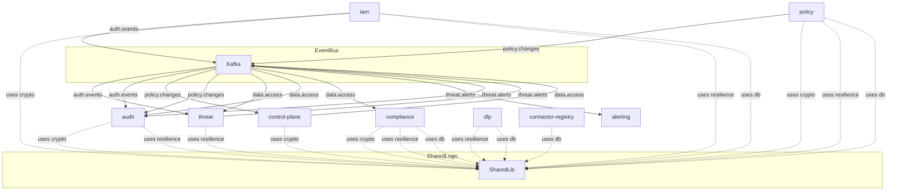

# System Topology Map

```mermaid
graph TD
    iam -- "auth.events" --> Kafka
    Kafka -- "auth.events" --> threat
    Kafka -- "auth.events" --> audit
    policy -- "policy.changes" --> Kafka
    Kafka -- "policy.changes" --> control-plane
    Kafka -- "policy.changes" --> audit
    control-plane -- "data.access" --> Kafka
    Kafka -- "data.access" --> threat
    Kafka -- "data.access" --> audit
    Kafka -- "data.access" --> compliance
    threat -- "threat.alerts" --> Kafka
    Kafka -- "threat.alerts" --> alerting
    Kafka -- "threat.alerts" --> audit
    iam -. "uses crypto" .-> SharedLib
    control-plane -. "uses crypto" .-> SharedLib
    policy -. "uses crypto" .-> SharedLib
    audit -. "uses crypto" .-> SharedLib
    compliance -. "uses crypto" .-> SharedLib
    iam -. "uses resilience" .-> SharedLib
    policy -. "uses resilience" .-> SharedLib
    threat -. "uses resilience" .-> SharedLib
    audit -. "uses resilience" .-> SharedLib
    compliance -. "uses resilience" .-> SharedLib
    dlp -. "uses resilience" .-> SharedLib
    iam -. "uses db" .-> SharedLib
    policy -. "uses db" .-> SharedLib
    compliance -. "uses db" .-> SharedLib
    dlp -. "uses db" .-> SharedLib
    connector-registry -. "uses db" .-> SharedLib
    subgraph SharedLogic
        SharedLib
    end
    subgraph EventBus
        Kafka
    end
```