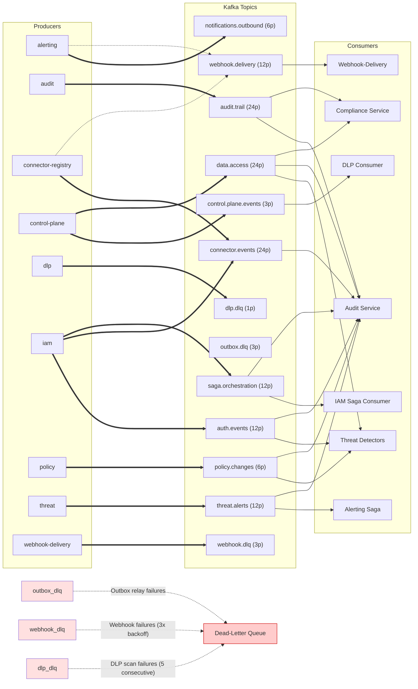
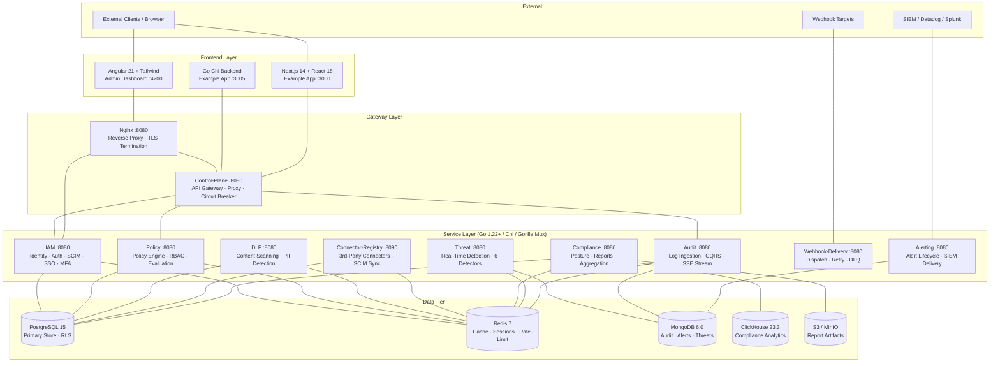
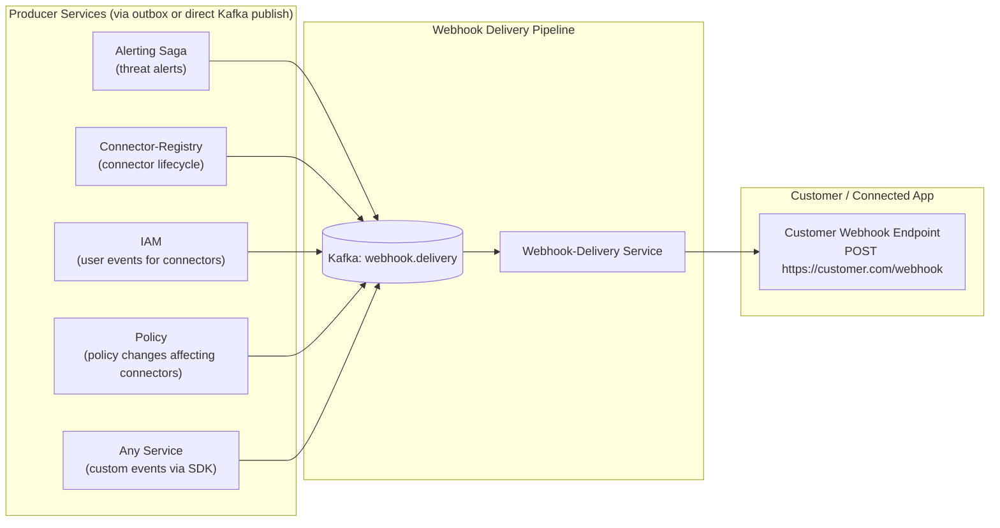
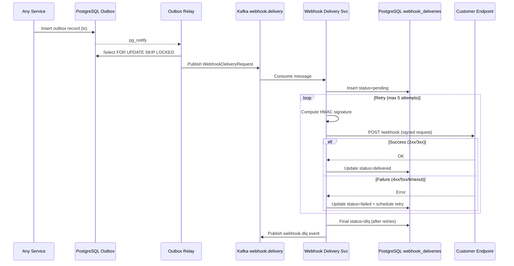

# System Topology Map

## 1. High-Level Architecture

```mermaid
graph TD

    %% External
    subgraph External["External World"]
        BROWSER[Browser / API Clients]
        SIEM[SIEM / Splunk / Datadog]
        WEBHOOK_TARGET[Webhook Targets]
    end

    subgraph Frontend["Frontend Layer"]
        ANG[Angular Admin Dashboard :4200]
        REACT[React Example App :3000]
        REACT_BE[Example App Go Backend :3005]
    end

    subgraph Gateway["Gateway Layer"]
        NX["Nginx Reverse Proxy :8080"]
        CP["Control-Plane :8080/8081"]
    end

    subgraph audit_&_compliance["Audit & Compliance"]
        audit["Audit :8085"]
        compliance["Compliance :8088"]
    end

    subgraph detection_&_alerting["Detection & Alerting"]
        threat["Threat :8084"]
        alerting["Alerting :8086"]
    end

    subgraph identity_&_auth["Identity & Auth"]
        iam["IAM :8082"]
    end

    subgraph integration_layer["Integration Layer"]
        webhook_delivery["Webhook-Delivery :8087"]
        connector_registry["Connector-Registry :8090"]
    end

    subgraph policy_&_dlp["Policy & DLP"]
        policy["Policy :8083"]
        dlp["DLP :8089"]
    end

    subgraph Data["Data Tier"]
        PG[("PostgreSQL 15 :5432")]
        R[("Redis 7 :6379")]
        M[("MongoDB 6.0 :27017")]
        CH[("ClickHouse 23.3 :8123")]
        S3[("S3 / MinIO :4566")]
    end

    subgraph EventBus["Event Bus"]
        K[("Kafka 7.4 :9092")]
    end

    subgraph Monitoring["Observability Stack"]
        PROM[Prometheus :9090]
        GRAF[Grafana :3010]
        JAEG[Jaeger :16686]
        LOKI[Loki :3100]
    end

    subgraph Shared["Shared Library (shared/)"]
        SH_LIB["Crypto · Resilience · Middleware\nDB · Telemetry · Kafka"]
    end

    %% Frontend to Gateway
    BROWSER --> NX
    ANG --> NX
    REACT --> CP
    REACT --> REACT_BE
    REACT_BE -. SDK .-> policy

    %% Gateway to Services
    NX --> iam
    NX --> CP
    CP --> iam
    CP --> policy
    CP --> audit

    %% Services to Data Stores
    iam --> PG
    iam --> R
    policy --> PG
    policy --> R
    dlp --> PG
    dlp --> R
    threat --> M
    threat --> R
    alerting --> M
    alerting --> R
    audit --> M
    audit --> R
    compliance --> PG
    compliance --> CH
    compliance --> S3
    compliance --> R
    webhook_delivery --> PG
    connector_registry --> PG
    connector_registry --> R

    %% Transactional Outbox
    iam ==> PG
    policy ==> PG

    %% Kafka Producers
    iam --> K
    policy --> K
    dlp --> K
    threat --> K
    alerting --> K
    audit --> K
    webhook_delivery --> K
    control_plane --> K

    %% Kafka Consumers
    K --> alerting
    K --> audit
    K --> compliance
    K --> dlp
    K --> iam
    K --> threat
    K --> webhook_delivery

    %% External Integrations
    alerting -. "SIEM Webhook (HMAC-SHA256)" .-> SIEM
    webhook_delivery -. "Webhook Delivery\n(retry + DLQ)" .-> WEBHOOK_TARGET

    %% Monitoring
    iam --> PROM
    policy --> PROM
    dlp --> PROM
    threat --> PROM
    alerting --> PROM
    audit --> PROM
    compliance --> PROM
    webhook_delivery --> PROM
    connector_registry --> PROM
    control_plane --> PROM
    PROM --> GRAF
    iam --> JAEG
    policy --> JAEG
    dlp --> JAEG
    threat --> JAEG
    alerting --> JAEG
    audit --> JAEG
    compliance --> JAEG
    webhook_delivery --> JAEG
    connector_registry --> JAEG
    control_plane --> JAEG
    LOKI --> GRAF

    %% Shared Library
    iam -.-> SH_LIB
    policy -.-> SH_LIB
    dlp -.-> SH_LIB
    threat -.-> SH_LIB
    alerting -.-> SH_LIB
    audit -.-> SH_LIB
    compliance -.-> SH_LIB
    webhook_delivery -.-> SH_LIB
    connector_registry -.-> SH_LIB
    control_plane -.-> SH_LIB

```

---

## 2. Kafka Event Flow — Topic-Level Trace

All event-driven communication follows the **Transactional Outbox** pattern: services write to a local PostgreSQL `outbox_records` table within the same transaction as business logic, then an Outbox Relay polls and publishes to Kafka. Consumers read asynchronously.

| `audit.trail` | 24 | audit | audit, compliance | Canonical audit trail |
| `auth.events` | 12 | iam | threat, audit | Authentication, login, MFA events |
| `connector.events` | 24 | iam | audit | Connector lifecycle events |
| `control.plane.events` | 3 | control-plane | dlp | Events for DLP content scanning |
| `data.access` | 24 | control-plane | threat, audit, compliance | Data access events from protected apps |
| `dlp.dlq` | 1 | dlp | — | Dead letters: DLP scan failures |
| `notifications.outbound` | 6 | alerting | — | User notifications |
| `outbox.dlq` | 3 | outbox-relay | — | Dead letters: outbox publish failures |
| `policy.changes` | 6 | policy | threat, audit | Policy CRUD and assignment changes |
| `saga.orchestration` | 12 | iam | iam, audit | Provisioning saga coordination |
| `threat.alerts` | 12 | threat | alerting, audit | Detected threat alerts |
| `webhook.delivery` | 12 | alerting, connector-registry, any service | webhook-delivery | Webhook dispatch queue |
| `webhook.dlq` | 3 | webhook-delivery | — | Dead letters: webhook delivery failures |

---

## 3. Layered System Stack

---

## 4. Service Registry

| # | Service | Port | Data Stores | Produces (Kafka) | Consumes (Kafka) | Router |
|:-:|---------|:----:|-------------|------------------|------------------|--------|
| 1 | **IAM** | 8082 | pg, redis | auth.events, saga.orchestration, connector.events | saga.orchestration | chi/v5 |
| 2 | **Policy** | 8083 | pg, redis | policy.changes | — | chi/v5 |
| 3 | **DLP** | 8089 | pg, redis | dlp.dlq | control.plane.events | gorilla/mux |
| 4 | **Threat** | 8084 | mongo, redis | threat.alerts | auth.events, policy.changes, data.access | chi/v5 |
| 5 | **Alerting** | 8086 | mongo, redis | notifications.outbound, webhook.delivery | threat.alerts | gorilla/mux |
| 6 | **Audit** | 8085 | mongo, redis | audit.trail | auth.events, policy.changes, data.access, threat.alerts, connector.events, saga.orchestration, audit.trail | std ServeMux |
| 7 | **Compliance** | 8088 | pg, clickhouse, s3, redis | — | audit.trail | gorilla/mux |
| 8 | **Webhook-Delivery** | 8087 | pg | webhook.dlq | webhook.delivery | gorilla/mux |
| 9 | **Connector-Registry** | 8090 | pg, redis | connector.events | — | chi/v5 |
| 10 | **Control-Plane** | 8081 | — | control.plane.events | — | chi/v5 |

---

## 5. Port Map

| Component | Internal Port | External Port | Protocol |
|-----------|:------------:|:-------------:|:--------:|
| Nginx Gateway | 8080 | 8080 | HTTP / HTTPS |
| Control-Plane | 8080 | 8081 | HTTPS (mTLS) |
| IAM | 8080 / 8443 | 8082 | HTTPS (mTLS) |
| Policy | 8080 | 8083 | HTTPS (mTLS) |
| Threat | 8080 | 8084 | HTTPS (mTLS) |
| Audit | 8080 | 8085 | HTTPS (mTLS) |
| Alerting | 8080 | 8086 | HTTPS (mTLS) |
| Webhook-Delivery | 8080 | 8087 | HTTPS (mTLS) |
| Compliance | 8080 | 8088 | HTTPS (mTLS) |
| DLP | 8080 | 8089 | HTTPS (mTLS) |
| Connector-Registry | 8080 | 8090 | HTTPS (mTLS) |
| Example App Backend | 3005 | 3005 | HTTP |
| Example App Frontend | 3000 | 3000 | HTTP |
| Angular Dashboard | 80 (nginx) | 4200 | HTTP |
| PostgreSQL | 5432 | 5432 | PG wire |
| Redis | 6379 | 6379 | RESP |
| Kafka | 9092 | 9092 | Kafka protocol |
| ZooKeeper | 2181 | 2181 | ZK protocol |
| MongoDB | 27017 | 27017 | MongoDB wire |
| ClickHouse HTTP | 8123 | 8123 | HTTP |
| ClickHouse Native | 9000 | 9000 | TCP |
| LocalStack (S3) | 4566 | 4566 | HTTP |
| Prometheus | 9090 | 9090 | HTTP |
| Grafana | 3010 | 3010 | HTTP |
| Jaeger UI | 16686 | 16686 | HTTP |
| Jaeger gRPC | 4317 | 4317 | gRPC |
| Loki | 3100 | 3100 | HTTP |

---

## 6. Communication Patterns

| Pattern | Protocol | Examples | Characteristics |
|---------|----------|---------|----------------|
| **Sync REST** | HTTP/mTLS | Gateway → Policy, Gateway → IAM | Request/response, circuit-broken, correlation IDs |
| **Async Events** | Kafka (Transactional Outbox) | IAM → `auth.events`, Policy → `policy.changes` | Exactly-once delivery, at-least-once consumption |
| **SSE (Server-Sent Events)** | HTTP/Streaming | Audit SSE → Dashboard | Real-time audit log streaming to frontend |
| **SDK Inline** | gRPC/HTTP | Example App → Policy (SDK) | Synchronous policy evaluation with 60s TTL caching |
| **SIEM Outbound** | HTTPS POST (HMAC-SHA256) | Alerting → Splunk/Datadog/Sentinel | Signed payloads with replay protection |
| **Webhook Delivery** | HTTPS POST (HMAC-SHA256) | Webhook-Delivery → Customer Endpoint | Signed payloads, 5× retry (1s-16s backoff), SSRF-protected, DLQ on exhaustion |

---

## 7. Key Architectural Patterns

| Pattern | Where | Description |
|---------|-------|-------------|
| **Transactional Outbox** | IAM, Policy | Write to `outbox_records` in same PG transaction → Relay polls/publishes to Kafka |
| **RLS (Row-Level Security)** | PostgreSQL (all services) | `app.current_org_id` session variable enforces multi-tenant isolation |
| **CQRS** | Audit (MongoDB) | Write-optimized primary + read-optimized secondary for audit logs |
| **Circuit Breaker** | Control-Plane → Policy/IAM | gobreaker-based, 30s open duration, 5-failure threshold |
| **Bulkhead** | Compliance, Alerting | Max 10 concurrent report generations, 50 concurrent alert processing |
| **Fail-Closed SDK** | Example App | 60s TTL cache; deny access if control plane unreachable |
| **mTLS** | All service-to-service | Mutual TLS for encrypted + authenticated communication |
| **Dead-Letter Queue** | Outbox, Webhook, DLP | Failed messages routed to DLQ topics after retry exhaustion |

---

## 8. Threat Detectors (Internal Detail)

| Detector | Consumes From | Trigger | Action |
|----------|---------------|---------|--------|
| BruteForceDetector | `auth.events` | >11 failed logins in window | Publish `threat.alerts` |
| ImpossibleTravelDetector | `auth.events` | Geo-velocity > threshold (GeoLite2) | Publish `threat.alerts` |
| OffHoursDetector | `auth.events` | Access outside 22:00–06:00 | Publish `threat.alerts` |
| DataExfiltrationDetector | `data.access` | Anomalous data volume/patterns | Publish `threat.alerts` |
| AccountTakeoverDetector | `auth.events` | Behavioral anomaly (device/IP/geo) | Publish `threat.alerts` |
| PrivilegeEscalationDetector | `auth.events` + `policy.changes` | Suspicious role/privilege changes | Publish `threat.alerts` |

---

---

## 9. Webhook Event Flow — Open Guard → Connected App

### Design

Any service can publish `WebhookDeliveryRequest` messages to Kafka `webhook.delivery`. The webhook-delivery service consumes these, HMAC-signs the payload, and POSTs to the customer's registered webhook URL with retry and DLQ on exhaustion.

### Event Producers → `webhook.delivery`

### Webhook Delivery Sequence

### Payload Envelope

Events sent to customer webhooks include the `event_type` field for routing. The full set of event types that may be delivered:

| Namespace | Event Types | Example |
|-----------|-------------|---------|
| **Auth** | `auth.login.success`, `auth.login.failure`, `password.changed` | `{"event_type":"auth.login.success","user_id":"...","org_id":"...","timestamp":"..."}` |
| **Data Access** | `resource.read`, `resource.write`, `resource.delete`, `data.bulk.read`, `access.denied` | `{"event_type":"access.denied","user_id":"...","action":"task:list"}` |
| **Policy** | `policy.created`, `policy.updated`, `policy.deleted`, `role.grant` | `{"event_type":"policy.created","policy_id":"...","org_id":"..."}` |
| **User / Org** | `user.created`, `user.updated`, `user.deleted`, `user.reprovision`, `user.scim.provisioned`, `user.provisioning.failed`, `org.iam.offboarded`, `org.offboard` | `{"event":"user.created","user_id":"...","status":"initializing"}` |
| **Threats** | `threat.alert.created` | `{"type":"threat.alert.created","alert_id":"...","severity":"high"}` |
| **Connector** | Connector lifecycle events (created, suspended, deleted) | `{"event_type":"connector.created","connector_id":"..."}` |

### SSRF Protection

Outbound webhook requests are protected by `shared/middleware/security.go` — the `NewSafeHTTPClient` resolves the hostname once, validates all IPs against a blocked CIDR list, and pins the connection to prevent DNS rebinding:

- RFC-1918 (`10.0.0.0/8`, `172.16.0.0/12`, `192.168.0.0/16`)
- Loopback (`127.0.0.0/8`, `::1/128`)
- Link-local / cloud metadata (`169.254.0.0/16`, `fe80::/10`)
- GCP metadata (`fd00::/8`)
- Unspecified / CGNAT (`0.0.0.0/8`, `100.64.0.0/10`)

### Status

> **Current implementation status:** The `webhook-delivery` service is fully built (consumer loop, HMAC signing, SSRF guard, retry with exponential backoff, PostgreSQL state persistence, DLQ routing) but **no producer service currently publishes to `webhook.delivery`**. The SIEM webhook path in the alerting saga is also unwired (`siemURL = ""` at `services/alerting/pkg/saga/saga.go:108`). Connecting producers to this topic is the remaining step.

---

> **Legend:** ═══ thick/arrow line = transactional (outbox) write / Kafka publish, ─── thin line = direct connection / REST, - - - dashed = indirect/integration / SDK, (()) = data store