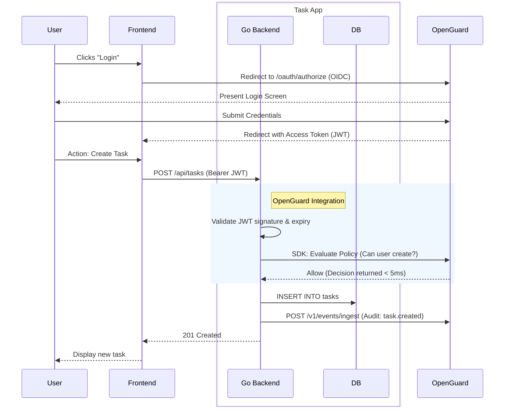

# Simple Task Management System Architecture

## 1. System Overview
The Simple Task Management System is a lightweight application designed to track user tasks and statuses. It leverages a vanilla HTML, CSS, and JavaScript frontend with a Go backend. To ensure robust security, authentication, and policy enforcement without reinventing the wheel, the system integrates natively with the **OpenGuard** control plane. All identity management (IAM), Role-Based Access Control (RBAC), and audit logging are delegated to OpenGuard.

## 2. Component Breakdown

### 2.1 Frontend (Vanilla HTML, CSS, JavaScript)
- **UI:** A simple, responsive interface for viewing, creating, and completing tasks.
- **Client Logic:** Uses the native `fetch` API to communicate with the Go backend.
- **Authentication Handling:** Receives OpenGuard-issued JWT access tokens via an OIDC authorization flow and attaches them as Bearer tokens to secure backend requests.

### 2.2 Backend (Go)
- **API Server:** A minimal Go REST API using the standard library (`net/http`) or a lightweight router (`chi`).
- **OpenGuard Integration:** Uses the OpenGuard SDK to validate JWT access tokens (checking signatures, expiration, and revocation) and evaluates policies for authorization (e.g., "Can this user delete this task?").
- **Audit Logging:** Sends critical user actions (like `task.created` or `task.deleted`) to OpenGuard's `POST /v1/events/ingest` endpoint to build an immutable audit trail.

### 2.3 OpenGuard (Centralized Security Control Plane)
- **IAM:** Acts as the Identity Provider (OIDC), handling user onboarding, login, session lifecycle, and token minting.
- **Policy Engine:** Evaluates real-time access requests submitted by the Go backend.
- **Event Ingestion:** Immutably stores audit events and detects potential threats in real time.

## 3. Data Model

The data model is decoupled from user management (managed strictly by OpenGuard) and handles only business logic. It can reside in an embedded SQLite or PostgreSQL database.

### `tasks` table
| Column | Type | Description |
|---|---|---|
| `id` | UUID | Primary Key |
| `title` | String | Task description |
| `status` | String | `pending` or `completed` |
| `owner_id` | UUID | The OpenGuard User ID of the task creator |
| `created_at` | Timestamp| When the task was created |
| `updated_at` | Timestamp| When the task was last updated |

## 4. API Structure

### Task Endpoints (Go Backend)
- `GET /api/tasks` - List tasks owned by the authenticated user.
- `POST /api/tasks` - Create a new task.
- `PUT /api/tasks/{id}` - Update a task (e.g., mark as completed).
- `DELETE /api/tasks/{id}` - Delete a task.

*Note: All endpoints require a valid OpenGuard Bearer token in the `Authorization` header.*

## 5. Auth Flow with OpenGuard

1. **Login:** The user opens the Task App frontend and clicks "Login".
2. **Redirect:** The frontend redirects the user to the OpenGuard IAM login portal for SSO.
3. **Authenticate:** The user authenticates against OpenGuard (password, MFA, SSO).
4. **Token Issuance:** OpenGuard redirects the user back to the Task App with a short-lived JWT Access Token.
5. **API Calls:** The frontend makes `fetch` requests to `/api/tasks`, including the JWT in the `Authorization` header.
6. **Token Validation:** The Go backend intercepts the HTTP request, parses the JWT, validates the signature via OpenGuard's public key sets, and checks expiration.
7. **Policy Evaluation:** For sensitive actions, the backend queries the OpenGuard Policy Engine via the SDK to verify the user's permissions.

## 6. Request Flow Diagram

## 7. Key Design Decisions

1. **Decoupled Identity:** The Task App does not maintain a `users` table or store passwords. All identity, session states, and credentials are offloaded to OpenGuard. The application only tracks the `owner_id` against tasks.
2. **Keep-It-Simple Frontend:** The frontend is implemented in vanilla HTML/CSS/JS without heavy build tools (like Webpack or React). This minimizes the learning curve and focuses purely on demonstrating OpenGuard integration.
3. **Fail-Closed Default:** Aligning with OpenGuard's principles, if the system cannot reach OpenGuard or verify a JWT, the backend fails closed (denies access) rather than failing open. It relies on the OpenGuard SDK's local cache for resilience.
4. **Native Audit Compliance:** Instead of building a bespoke logging database table for the application, standard actions are instantly passed to OpenGuard's `/v1/events/ingest` pipeline. This provides an out-of-the-box tamper-evident audit trail.
